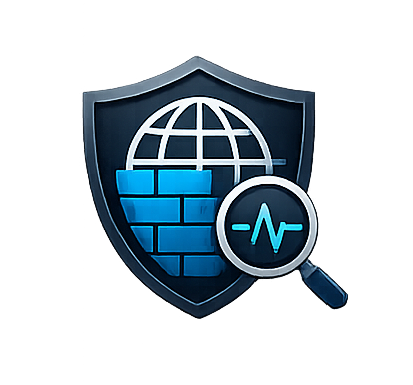

<p align="center">
  
</p>
<h1 align="center">WafSight</h1>
<p align="center">
  <em>High-performance WAF/CDN detection library and CLI for .NET</em>
</p>

<p align="center">
  <a href="https://www.nuget.org/packages/WafSight"></a>
  <a href="https://www.nuget.org/packages/WafSight"></a>
  <a href="LICENSE"></a>
  <a href="https://dotnet.microsoft.com"></a>
  <a href="https://github.com/rodrigoramosrs/wafsight/actions"></a>
  <a href="https://github.com/rodrigoramosrs/wafsight"></a>
  <a href="https://github.com/rodrigoramosrs/wafsight"></a>
  <a href="https://learn.microsoft.com/en-us/dotnet/core/deploying/native-aot"></a>
</p>

---

Detects Web Application Firewalls (WAF) and Content Delivery Networks (CDN) by analyzing HTTP headers, response bodies, cookies, status codes, DNS records, timing, TLS certificates, and payload probing.

## Features

- **8 built-in providers**: CloudFlare, AWS, Akamai, Fastly, Azure, Imperva, Sucuri, F5
- **Generic WAF detection** via payload probing (XSS, SQLi, LFI, XXE, RCE)
- **Weighted evidence scoring** with tiered confidence levels
- **DNS analysis** via CNAME, A, NS, and TXT records
- **Batch detection** with concurrency control
- **Resilient HTTP client** with retry and timeout policies
- **Dependency Injection support** for ASP.NET Core integration
- **CLI tool** with configurable verbosity levels
- **AOT native publishing** for cross-platform standalone executables
- **Extensible provider system** for custom WAF detection
- **Automatic versioning** (YYYY.M.0.MINOR format)

## Project Structure

```
WafSight/
├── .github/workflows/  # CI/CD automation
├── src/
│   ├── WafSight/              # Core library (DLL)
│   ├── WafSight/              # Core library + CLI (AOT native)
│   └── WafSight.Tests/        # Unit tests (xUnit)
├── Directory.Build.props      # Shared MSBuild properties
├── nuget.config               # NuGet configuration
└── README.md
```

## Quick Start

### Install the package

```bash
dotnet add package WafSight
```

### Use as a library

```csharp
using WafSight;
using Microsoft.Extensions.Logging;

// With default logging
using var client = new WafDetectorClient();

// With custom ILoggerFactory
var loggerFactory = LoggerFactory.Create(builder =>
{
    builder.AddConsole();
    builder.SetMinimumLevel(LogLevel.Information);
});
using var client = new WafDetectorClient(loggerFactory);

// Detect single URL
var result = await client.DetectAsync("https://example.com");

if (result.HasWaf)
{
    Console.WriteLine($"WAF: {result.Waf.Name} ({result.Waf.Confidence:P0})");
}

if (result.HasCdn)
{
    Console.WriteLine($"CDN: {result.Cdn.Name} ({result.Cdn.Confidence:P0})");
}

// Batch detection
var urls = new[] { "https://example.com", "https://cloudflare.com" };
var batchResults = await client.DetectBatchAsync(urls, maxConcurrency: 3);

// List providers
var providers = client.ListProviders();
```

### Use the CLI

```bash
# Detect a single URL (shows result by default)
WafSight detect https://example.com

# Show detailed logs with verbosity levels
WafSight -V 1 detect https://example.com    # Low: errors + basic status
WafSight -V 2 detect https://example.com    # Medium: + headers, DNS, scores
WafSight -V 3 detect https://example.com    # High: + payloads, evidence, timing

# Batch detect from a file
WafSight batch urls.txt

# List registered providers
WafSight providers

# Show help
WafSight --help
```

#### Verbosity Levels

| Level | Description |
|-------|-------------|
| `0` or `None` | Only errors and critical information (default) |
| `1` or `Low` | Errors + basic detection results |
| `2` or `Medium` | Low + headers, DNS records, provider scores |
| `3` or `High` | Medium + payload probing, evidence details, timing |

## Adding Custom Providers

```csharp
using WafSight;
using WafSight.Models;
using WafSight.Providers;

public class MyCustomProvider : IDetectionProvider
{
    public string Name => "MyProvider";
    public string Version => "1.0.0";
    public string Description => "Custom WAF detection";
    public ProviderType ProviderType => ProviderType.WAF;
    public double ConfidenceBase => 0.85;
    public int Priority => 50;
    public bool Enabled => true;

    public Task<List<Evidence>> DetectAsync(DetectionContext context)
    {
        var evidence = new List<Evidence>();

        if (context.Response is not null)
        {
            if (context.Response.Headers.TryGetValue("x-custom-waf", out var value))
            {
                evidence.Add(new Evidence
                {
                    Method = DetectionMethod.Header,
                    Name = "x-custom-waf",
                    Value = value,
                    Confidence = 0.90,
                    Description = "Custom WAF header detected"
                });
            }
        }

        return Task.FromResult(evidence);
    }

    public Task<List<Evidence>> PassiveDetectAsync(HttpResponseData response)
    {
        return DetectAsync(new DetectionContext { Response = response });
    }
}

// Register it
using var client = new WafDetectorClient();
client.RegisterProvider(new MyCustomProvider());
```

## Dependency Injection

```csharp
using Microsoft.Extensions.DependencyInjection;

services.AddWafDetector(options =>
{
    options.Timeout = TimeSpan.FromSeconds(15);
    options.EnableGenericDetection = true;
    options.EnableDnsAnalysis = true;
});

// Inject IWafDetector where needed
public class MyService
{
    private readonly IWafDetector _detector;

    public MyService(IWafDetector detector)
    {
        _detector = detector;
    }
}
```

## Detection Methods

| Method | Weight | Description |
|--------|--------|-------------|
| Header | 1.0 | HTTP headers (cf-ray, x-amz-cf-id, etc.) |
| DNS | 0.95 | DNS records (CNAME, NS, TXT) |
| Certificate | 0.90 | TLS certificate analysis |
| Cookie | 0.85 | Response cookies |
| StatusCode | 0.75 | HTTP status codes |
| Timing | 0.70 | Response timing analysis |
| Body | 0.50 | Response body patterns |
| Payload | 0.40 | Payload probing (XSS, SQLi, LFI) |

## Built-in Providers

| Provider | Type | Priority |
|----------|------|----------|
| CloudFlare | WAF + CDN | 100 |
| AWS (CloudFront) | WAF + CDN | 95 |
| Akamai | WAF + CDN | 90 |
| Fastly | CDN | 85 |
| Azure | WAF + CDN | 80 |
| Imperva | WAF | 75 |
| Sucuri | WAF | 70 |
| F5 BIG-IP | WAF | 65 |

## Versioning

Version format: `YYYY.M.0.MINOR`

- **YYYY**: Current year
- **M**: Current month
- **0**: Major (fixed)
- **MINOR**: Incremental counter per month

Example: `2026.7.0.1` = 1st release of July 2026

The version is automatically calculated by CI/CD based on existing GitHub releases.

## CI/CD

Automated workflow on push to `main`:
1. **Build & Test** - Runs all tests
2. **Publish NuGet** - Pushes `WafSight` package
3. **Publish Release** - Creates GitHub Release with AOT binaries:
   - `WafSight-win-x64.zip`
   - `WafSight-linux-x64.tar.gz`
   - `WafSight-osx-x64.tar.gz`
   - `WafSight-osx-arm64.tar.gz`

### Required Secrets

- `NUGET_API_KEY` - NuGet.org API key for package publishing

### Environments

- `nuget-publish` - Protects NuGet publishing
- `github-release` - Protects release creation

## Requirements

- .NET 10.0 or later

---

<p align="center">
  <a href="LICENSE"></a>
  <a href="https://www.nuget.org/packages/WafSight"></a>
  <a href="https://github.com/rodrigoramosrs/wafsight"></a>
</p>

## Special Thanks

This project would not exist without the inspiration and knowledge provided by these incredible open-source projects:

- [**waf-detector**](https://github.com/ammarion/waf-detector) — A fast and efficient WAF detection tool written in Go by Ammar Atef. Its architecture and provider model heavily influenced WafSight's design.
- [**wafw00f**](https://github.com/EnableSecurity/wafw00f) — The legendary WAF fingerprinting tool by EnableSecurity. Its signature-based detection approach and extensive provider database set the standard for the entire ecosystem.

If you find WafSight useful, consider showing your appreciation to these projects too — give them a star on GitHub, open issues, or contribute code. Open source thrives on community support.

To the maintainers and contributors of these projects: thank you for paving the way.